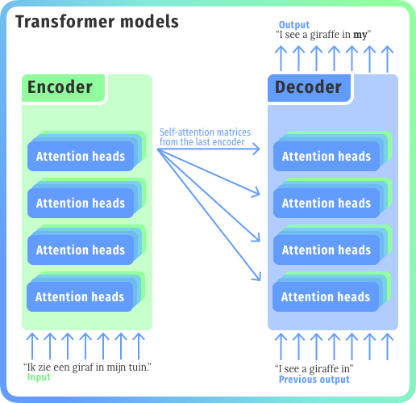
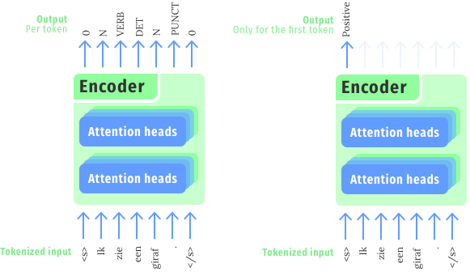
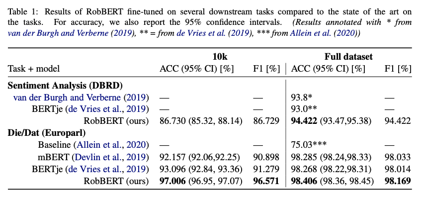

**This article is re-posted from DTAI Stories:** https://dtai.cs.kuleuven.be/stories/post/pieter-delobelle/robbert/


# What is RobBERT?

RobBERT is the state-of-the-art Dutch RoBERTa-based BERT language model, outperforming other language models for most Dutch natural language processing tasks.

The advent of neural networks in natural language processing (NLP) has significantly improved state-of-the-art results within the field. While recurrent neural networks (RNNs) and long short-term memory networks (LSTMs) initially dominated the field, recent models started incorporating attention mechanisms and then later dropped the recurrent part and just kept the attention mechanisms in so-called transformer models. This latter type of model caused a new revolution in NLP and led to popular language models like GPT-2 and ELMo. BERT improved over previous transformer models and recurrent networks by allowing the system to learn from input text in a bidirectional way, rather than only from left-to-right or the other way around. This model was later re-implemented, critically evaluated and improved in the RoBERTa model.

These large-scale transformer models provide the advantage of being able to solve NLP tasks by having a common, expensive pre-training phase, followed by a smaller fine-tuning phase. The pre-training happens in an unsupervised way by providing large corpora of text in the desired language. The second phase only needs a relatively small annotated data set for fine-tuning to outperform previous popular approaches in one of a large number of possible language tasks.

While language models are usually trained on English data, some multilingual models also exist. These are usually trained on a large quantity of text in different languages. For example, Multilingual-BERT is trained on a collection of corpora in 104 different languages and generalizes language components well across languages. However, models trained on data from one specific language usually improve the performance over multilingual models for this particular language. Training a RoBERTa model on a Dutch dataset thus has a lot of potential for increasing performance for many downstream Dutch NLP tasks.

## Language modeling with encoders
In NLP, encoder-decoder models have been used for some time. These models, often called sequence-to-sequence or seq2seq, are good at various sequence-based tasks: translations, token labeling, named entity recognition (NER), etc. Historically, these seq2seq models were usually LSTMs or other recurrent networks. A major improvement in these networks was an attention mechanism, that allowed to communicate more than one feature vector. (For those coming from computer vision, this looks a bit like the connections in UNet).

The by now famous transformer model was based solely on this attention mechanism. It features 2 stacks: (i) an encoder stack that uses multiple layers of self-attention and (ii) a decoder stack with attention layers that connect back to the encoder outputs.



We could also interpret this probabilistically, we have a language model


$$P(\text{“giraf"}|\text{“ik zie een &lt;mask&gt; in mijn tuin."})<0.0001$$


Or a more probable suggestion:

$$P(\text{boom"}|\text{“ik zie een &lt;mask&gt; in mijn tuin."}) = 0.1498$$

In fact, we can even query the model to get the most likely results. For this sentence, RobBERT gives us:

```
[('Ik zie een lamp in mijn tuin.', 0.39584335684776306, ' lamp'),
 ('Ik zie een boom in mijn tuin.', 0.1497979462146759, ' boom'),
 ('Ik zie een camera in mijn tuin.', 0.089895099401474, ' camera'),
 ('Ik zie een ster in mijn tuin.', 0.046020057052373886, ' ster'),
 ('Ik zie een stip in mijn tuin.', 0.009481011889874935, ' stip'),
 ('Ik zie een man in mijn tuin.', 0.009198895655572414, ' man'),
 ('Ik zie een slang in mijn tuin.', 0.009129301644861698, ' slang'),
 ('Ik zie een stem in mijn tuin.', 0.007939961738884449, ' stem'),
 ('Ik zie een bos in mijn tuin.', 0.007785357069224119, ' bos'),
 ('Ik zie een storm in mijn tuin.', 0.0077188946306705475, ' storm')]
 ```

# Fine-tuning and custom use-cases
As it happens, language models are quite expensive to train. We used a high-performance computing cluster with ~80 Nvidia P100’s for several days. This is because we train it on a large dataset (39 GB of text) with the word-masking objective, which means we randomly replace some words by a &lt;mask&gt; token (or another word or the same word, but those are less likely). After a few epochs, we have something that resembles the probabilistic language model we described earlier.

But this language model can do more than just filling in some &lt;mask&gt; tokens! This is one of the so-called heads, the one we use to pre-train our language model on. After training, we can easily take it off—perhaps calling them heads was a bit insensitive?—and replace it another one. This step is then called finetuning. All the weights of the model stay the same and we add a newly initialized head that we train on the data that we want. And since most weights are from the trained base model, we only need a fraction of the data. So it will go a lot faster as well!



You can also fine-tune RobBERT on your own (Dutch) data, which can save you a lot of training time and you'll likely need fewer labeled examples. Some projects are already using RobBERT in the wild:

- **Detecting new job titles for VDAB**: Jeroen Van Hautte, Vincent Schelstraete, and Mikaël Wornoo, ‘Leveraging the Inherent Hierarchy of Vacancy Titles for Automated Job Ontology Expansion’, [ArXiv:2004.02814](http://arxiv.org/abs/2004.02814), 6 April 2020.
- **'Die' versus 'dat' disambiguation for L2 learners**: Small pilot with the 'Die' vs. 'dat' disambiguation model to give feedback to second language learners. [Implemented as a REST api](https://github.com/iPieter/RobBERT/tree/master/examples/die_vs_data_rest_api) to be used alongside a rule-baed system.
- **DeepFrog - NLP Suite**: A successor for the Dutch NLP suite Frog with fine-tuned models based on <code>RobBERT-v1-base</code>. [Available on Github](https://github.com/proycon/deepfrog).
- **'Spelfouten': Dutch spell checking with BERT**: [Various experiments](https://github.com/petervandenabeele/spelfouten) on detecting and correcting grammar mistakes with a focus on frequently made "dt"-mistakes, based on <code>RobBERT-v1-base</code>.

# Results
We evaluated RobBERT on two tasks with Dutch text inputs: (i) sentiment analysis and distinguishing between _die_ and _dat_. Table 1 shows the results, where we trained most models twice. Once on the full training set and once on a smaller subset, to highlight a benefit of monolingual language resources over multilingual ones.



#
