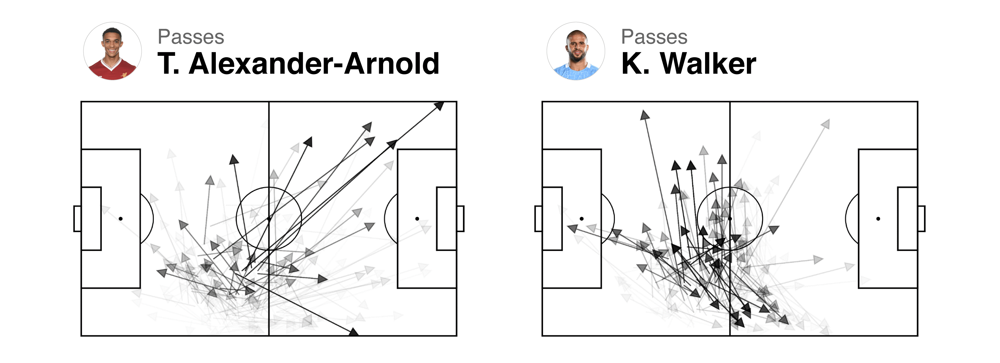
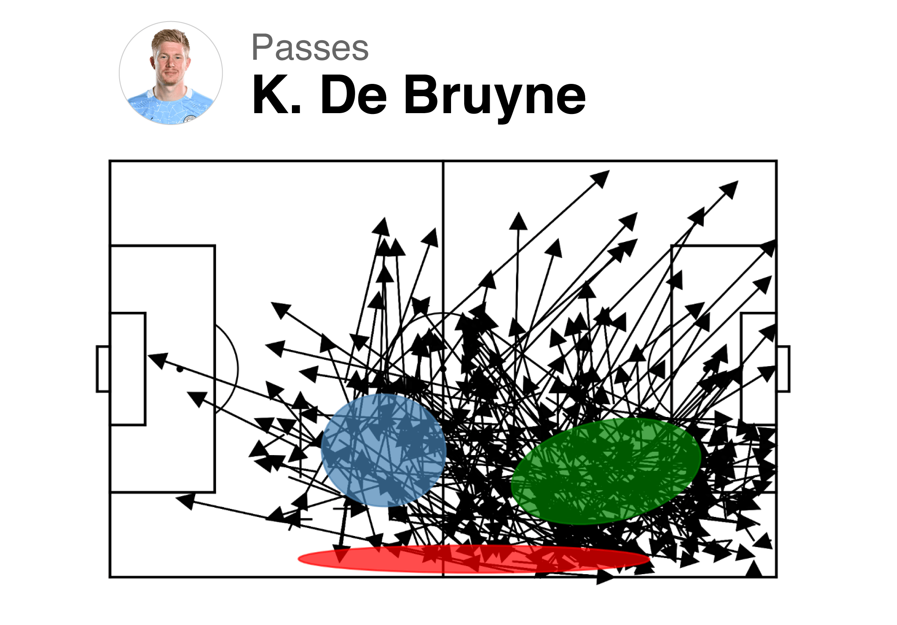
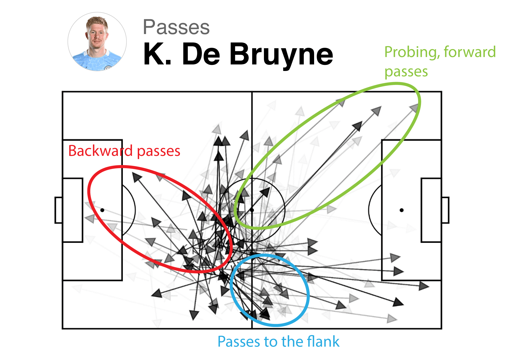
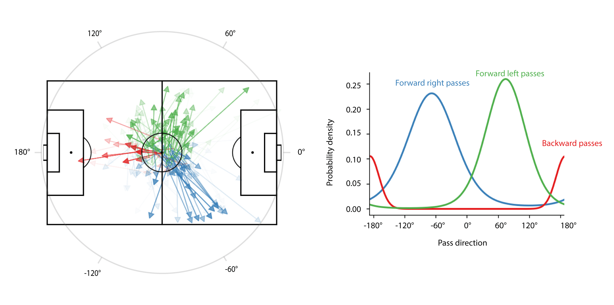
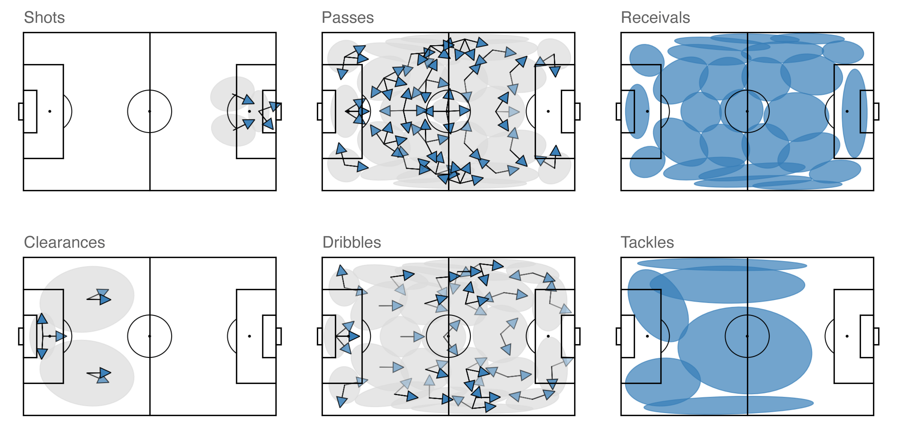
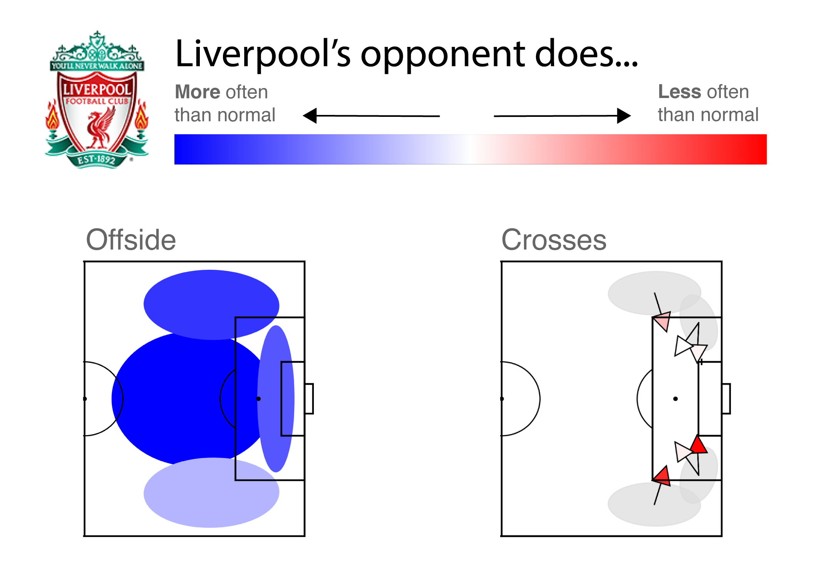
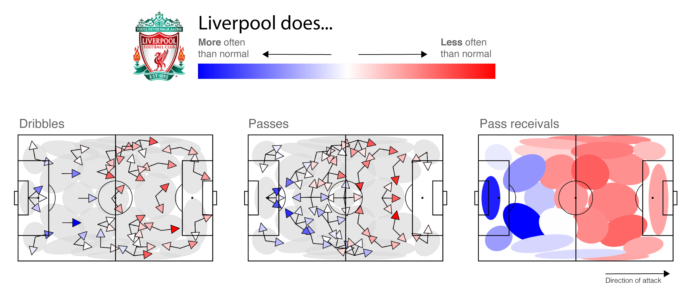
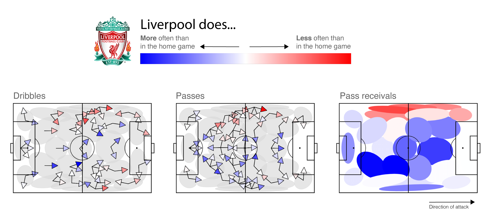

{}
This content is reposted with permission from the [DTAI Sports Analytics Blog](https://dtai.cs.kuleuven.be/sports/blog/soccermix:-representing-soccer-actions-with-mixture-models)
{}

Last year, we introduced our [Player Vectors](https://dtai.cs.kuleuven.be/sports/blog/player-vectors:-characterizing-soccer-players'-playing-style/) approach for automatically characterizing a player’s style of play. In the meantime, we haven’t been standing still and developed SoccerMix: an improved approach which takes account of the location __and direction__ in which actions are performed. Beyond this, we have also introduced a methodology for exploring defensive style. Namely, our insight is that the objective of defending is often to prevent certain actions from occurring. Hence, some insights into a team’s defensive style can be found by measuring how a team forces its opponents to deviate from their usual playing style.

In this blog post, we describe SoccerMix and illustrate its applicability in three relevant use cases for the 2018/19 Premier League season:

1. __Player comparisons:__ How do the playing styles of Firmino and Agüero differ?
2. __Defensive analysis:__ How did Liverpool force its opponents to deviate from their typical style?
3. __Match analysis:__ Did Liverpool deviate from its usual style in the crucial away match against City in 2018/19?

### Playing Style = Location + Action + Direction

Previously, our working hypothesis in this area was that a player’s style manifests itself by:

1. His or her preferred locations to occupy on the pitch, and
2. Which actions he or she performs in each location

This hypothesis ignores one crucial piece of information. To illustrate that, consider two right-backs: Trent Alexander-Arnold and Kyle Walker. Alexander-Arnold is known for his creative and adventurous passing style. While sometimes risky, these passes have the potential to generate a lot of danger. In contrast, Walker tends to make shorter and more lateral passes. This difference in style is clearly visible in the passing maps for each player from one general location on the pitch:

These show that Alexander-Arnold and Walker tend to move the ball in very different directions from this location, which provides evidence that __the direction players move the ball in from a location is another crucial aspect of playing style__ that should be added to our hypothesis.

### The SoccerMix Approach

The key challenge then is to come up with a succinct way to capture the action-location-direction relationship for each player. Previously, our [Player Vectors](https://dtai.cs.kuleuven.be/sports/blog/player-vectors:-characterizing-soccer-players'-playing-style/) approach used [non-negative matrix factorization (NMF)](https://blog.acolyer.org/2019/02/18/the-why-and-how-of-nonnegative-matrix-factorization/) to perform a location-based grouping of actions into a small set of prototypical or canonical actions. To illustrate this idea, the figure below shows the canonical shot actions that we identified.

Grouping actions on both the location and direction poses several challenges. First, we need to be able to group actions based on both discrete (i.e., action type) and continuous properties. Second, we need to ensure that we group the actions on the right level of granularity. There should not be overly large clusters and similarly we do not want many groups with little or no actions in them. Finally, we need to be able to perform the groupings while accounting for the fact that locations and directions have different notions of similarity. In particular, NMF would struggle to cope with these last two challenges when forced to simultaneously consider both location and direction. This necessitates a fundamentally different approach to grouping actions.

SoccerMix finds canonical actions by using [mixture models](https://towardsdatascience.com/gaussian-mixture-models-explained-6986aaf5a95) to group together similar actions on the basis of their start location and direction. Mixture models differ from k-means in two important ways. First, they represent each cluster using a probability distribution instead of a centroid. Second, each object has a probability of belonging to each cluster instead of assigning the object to precisely one cluster. Hence, mixture models are often referred to as a soft version of k-means.

SoccerMix uses the following two-step approach for each considered action type.

1. First, it performs __a location-based clustering of actions__. For example, consider the passes made on the right third of the field by Kevin De Bruyne in the 2018/2019 season and one can immediately see some common starting locations. To automatically discover, such groupings, SoccerMix clusters the start locations of all actions using a mixture of Gaussian distributions.

2. Second, it performs __a direction-based soft clustering of actions__ in each location group. To illustrate the intuition, let’s focus on one cluster of De Bruyne’s passes:

Here, it is possible to see that De Bruyne tends to play the ball backwards (shown in red), to the right flank (shown in blue) or in a probing, forward manner (shown in green). To capture directionality, we first use an action’s start and end location to derive its direction. Then, SoccerMix clusters all the actions in a location group using a mixture of [Von Mises distributions](https://en.wikipedia.org/wiki/Von_Mises_distribution), which are suitable for circular data. The use of Von Mises distributions are needed to describe backward passes. This is illustrated in the figure below, which shows the learned Von Mises distribution for passes that start in the central midfield. Unlike a Gaussian, a single Von Mises distribution can be fitted to passes close to 170° and -170°.

The end result of SoccerMix are a number of prototypical actions:

### What can you do with this analysis?
SoccerMix can facilitate a number of interesting analyses, both on the player and team level. Here we will focus on three canonical cases. On the player level, we will show how to compare and contrast the playing style between two players. On the team level, we compare how often a team’s behavior differs in a specific match versus their typical behavior in all other matches.

#### Player comparisons: How do the playing style of Firmino and Agüero differ?
Sergio Agüero (Manchester City) and Roberto Firmino (Liverpool) are two world-class strikers. However, they approach the position differently. Agüero’s playing style is more like an out-and-out striker who most dominantly operates around the opponent’s penalty box. Firmino on the other hand is a striker who likes to drop deep and facilitate for Salah and Mane. SoccerMix picks up on this difference. Below we show the relative frequency that each player performs each prototypical shot, take-on, receival and pass. Actions shown in blue mean that Agüero performs the action more often than Firmino does, and those shown in red mean the opposite. Agüero indeed receives the ball more often close to the goal and is more likely to shoot. In contrast, Firmino is more active in receiving and passing the ball in the middle of the field.

#### Defensive analysis: How did Liverpool force its opponents to deviate from their typical style?
Analyzing defensive style is much harder as it involves off-the-ball actions such as correct positioning and putting pressure on attackers, which are not recorded in event streams. Our insight is that these off-the-ball actions are often performed with the intention of preventing certain actions from occurring. This suggests that we can gain a partial understanding of defensive style by measuring the effects that a team’s off-the-ball actions have on what on-the-ball actions their opponent performs. More precisely, we analyze how a team forces its opponents to deviate from their usual playing style. To illustrate this, we compare how teams play in their games (1) vs. Liverpool and (2) vs. all other opponents. Liverpool’s opponent is playing from left-to-right, and prototypical actions shown in blue (red) mean that teams perform these actions more (less) often when playing Liverpool than in their other matches.

When playing Liverpool, teams tend to be flagged for offside more often than they typically are against other opponents. This indicates a well-synchronized line of defense that employs a very effective offside trap. The crosses show that, although Liverpool limits the number of crosses its opponents perform, this restriction is not symmetric: they allow fewer crosses from the left of defense (the offense’s right) than the right

#### Match analysis: Did Liverpool deviate from its usual style in the crucial away match against City?
On January 3rd, 2019, Liverpool held a 6 point lead atop the EPL table when they traveled to play Manchester City in a highly anticipated match. Alas, in their only league loss of the season, [Liverpool fell 2-1](https://www.theguardian.com/football/2019/jan/03/manchester-city-liverpool-premier-league-match-report) and ended up missing out on the title to Manchester City by a single point. Using SoccerMix, we see that Manchester City had the front foot and forced Liverpool to play deeper in their own half:

Prototypical actions shown in red (blue) indicate that Liverpool performed more (less) of these actions in this match than would be typical. We see that Liverpool has many more passes, dribbles, and receivals deep in their own half than is typical.

These findings are perhaps not surprising given Manchester City’s strength and the fact that the match took place at the Etihad. To dig deeper, we compare Liverpool’s playing style in this lost match to their earlier match versus Manchester City at Anfield, which they drew.

When playing away, Liverpool made noticeably less use of its left flank, performing fewer passes, dribbles, and receivals in that area. This suggests that Liverpool’s left flank players were not functioning very well that match, which is further evidenced by midfielder James Milner and winger Sadio Mané on Liverpool’s left flank being substituted out in the 57th and 77th minute of the match.

_This research was [published at ECML/PKDD 2020](https://bitbucket.org/ghentdatascience/ecmlpkdd20-papers/raw/master/RT/sub_194.pdf) and the [source code](https://github.com/ML-KULeuven/soccermix) is available online. TD, MVR and JD did the scientific developments. PR helped with writing the blogpost and the visualizations. Data provided by StatsBomb._
