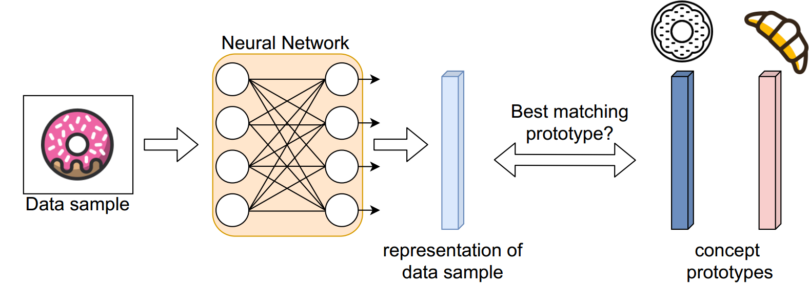
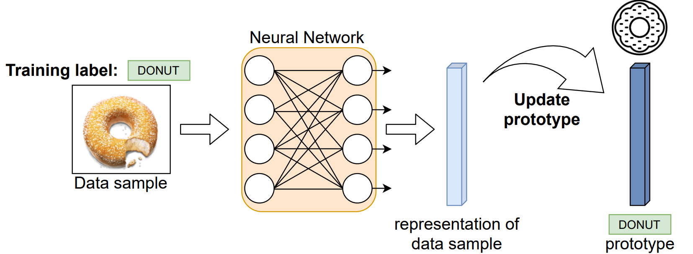
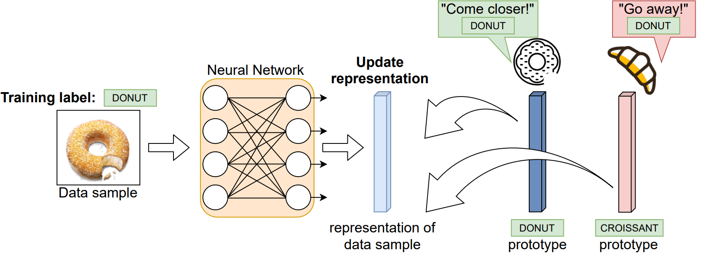
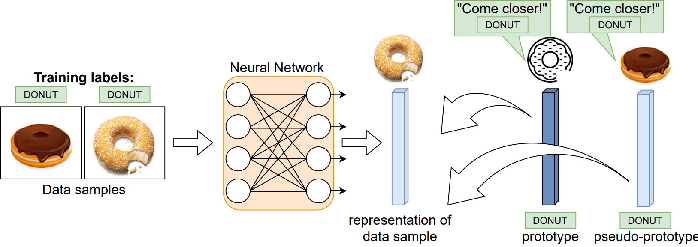
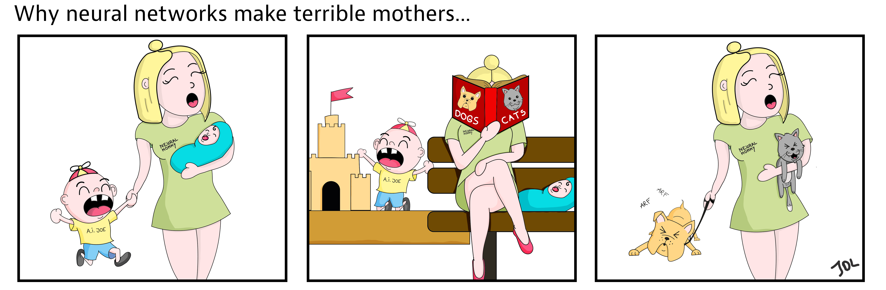

Machine learning (ML) is a type of Artificial Intelligence (AI) where machines can learn from huge amounts of data, such as images or text, containing highly complex patterns. Previously, these patterns had to be discovered based on hand-crafted rules of thumb, whereas today the horse-power of machine learning algorithms resides in discovering these patterns automatically. Many contemporary successes are mainly thanks to the resurgence of a specific machine learning algorithm, called artificial neural networks. These neural networks excel in a wide range of relevant tasks, ranging from detecting pedestrians and cars in videos, to [generating convincing articles](https://www.nature.com/articles/d41586-021-00530-0), and even greatly [facilitating drug discovery by predicting protein structures](https://deepmind.com/blog/article/alphafold-a-solution-to-a-50-year-old-grand-challenge-in-biology).
Traditional machine learning typically first learns a model using all the available examples in the data and is then deployed for real-world use. This means that whenever a model has finished learning, it remains unchanged when used in practice. The model's static nature is problematic as it doesn't befit our ever-changing world. For example, with the rise of autonomous vehicles and the internet of things (IoT), data becomes available at previously unprecedented rates and continuously changes over time. This leaves many contemporary machine learning approaches in the dark, as the static model at deployment can't put the never-ending flow of data to use. **Continual Learning** aims to tackle this problem by taking a closer look at dynamic machine learning models, adapting to the data flexibly and continuously.

## Overcoming a Catastrophe

Let's consider an object detection system for a self-driving car. For safe operation, we give our car the task to detect pedestrians and cyclists. By training our neural network with a large number of samples, it does a remarkable job. However, new object categories emerge all around, such as hoverboards and electrical steps. If we were to update our detection system now with a host of corresponding images for this new task, again it would do a remarkable job at detecting hoverboards and electrical steps. But there is a catch: our system would completely forget about the pedestrians and cyclists in the old task, hence leaving them undetected! This is a phenomenon known as **catastrophic forgetting** in neural networks.

Continual Learning explores how to learn sequentially without this catastrophic forgetting, such that the neural network remembers all learned concepts over time. The most obvious way to remember what is learned from the data, is by simply storing it all and revisiting it later whenever we are about to learn a new task. However, we have to take into account that these data streams might be never-ending, which doesn't abide with the certainly-ending memory in our machines. Therefore, it is paramount to overcome catastrophic forgetting within the predefined memory constraints of our system.

A body of Continual Learning methods has been proposed to deal with this issue and can be mainly [divided within three families](https://arxiv.org/pdf/1909.08383.pdf).
The first family of *regularization methods* typically constrains connections between neurons to remain unchanged when they are deemed to be important for an old task. The importance for each connection is tracked to urge new tasks to learn only with connections irrelevant to the old tasks, which [greatly alleviates catastrophic forgetting](https://openaccess.thecvf.com/content_ECCV_2018/html/Rahaf_Aljundi_Memory_Aware_Synapses_ECCV_2018_paper.html).
Secondly, the family of *parameter isolation methods* takes another approach by directly allocating a part of the network to each task. As each task is only able to alter its own part of the network, the other tasks can't interfere when learning a new task.
Finally, the family of *replay methods* stores a small part of the seen data, which is then reused later while learning a new task. It's a simple approach but with some additional benefits, which we'll explore in more detail later in this article! But first, we need to explain how neural networks learn and represent the world.

## Representing the world
Whenever we think about a concept, say a *donut*, we can imagine such delight in many varieties, differing in properties such as color and size. Even more so, if we would encounter a sugarcoated torus-shaped pastry in a color we've never seen before, we are still able to allocate it to this same semantic concept. This is because our human brains often use [representative heuristics](https://www.sciencedirect.com/science/article/abs/pii/0010028572900163), where each concept is represented by a most representative prototype.

Neural networks are built by multiple consecutive layers of neuron-like units, remotely based on neurons in the human brain. Typically, many consecutive layers are used, which is why it is often referred to as **deep learning**. This hierarchy of layers allows building increasingly complex representations. In case of the donut example, early layers would have some low-level processing like the curved lines and the color, whereas later layers combine these properties to form the representation of the donut. If we now observe a lot of donut images, we can combine all of their representations to make the donut prototype. You can think of this prototype as the most generic, plain donut any other donut would resemble.

Eventually, we want such a representative prototype for each of the concepts in our data. In fact, these prototypes capture the most important characteristics of the related concept so well, that when we give a new image to our network it has never seen before (e.g. take a picture with your smartphone), it could tell you which concept's prototype it corresponds to (you took a picture of a donut). This predicting of unseen images is called the **testing** phase, and can be visualized as in the following:



<!--  -->
<!-- *In the testing phase, the neural network takes in a new data sample, such as an image of a donut, and produces a representation containing the sample's characteristics. By matching this representation to the prototypes of the concepts, we can predict the concept with the most similar prototype, which is in this case ideally the donut.* -->

But in order to obtain these prototypes, we need the neural network to learn in some way from the images it gets presented, this process is called the **training** phase. First of all, the neural network needs an indication of the concepts in an image, such that its corresponding prototype can be identified. Typically, a human supervisor comes into play, annotating each image with a label, indicating it contains one or the other concept, and hence indicating the prototype each image belongs to.

Now that each image is associated with a certain prototype, we can train the neural network by means of an **error function**. When the representation of the image ends up far from the prototype, we tell the network to make changes in its connections between the neurons, such that the representation becomes more similar to its prototype, and matches less with the other concepts' prototypes. This standard error in machine learning is called the Cross-Entropy error, but has severe limitations when used for continual learning. As we only see images from concepts in our current task, the prototypes of the old task's concepts are uncontrollably changed, such that they are no longer the most generic representation.
In other words, the old prototypes lose their ability to serve as a good approximation to detect future instances of their related concept. Hence, the old task concepts are prone to catastrophic forgetting. This indicates that for Continual Learning, training clearly needs an alternative for this Cross-Entropy error, maintaining the quality of our prototypes.

## Evolving prototypes

Recent work in the lab of Prof. Tinne Tuytelaars addresses the problem of deteriorating prototypes by means of **Continual Prototype Evolution**, referred to as [CoPE](https://arxiv.org/abs/2009.00919). The primary goal of this Continual Learning approach is to keep the prototypes for all concepts up-to-date at all times. As the knowledge about our previous concepts resides within our adaptive prototypes, we don't need to store all data for retraining as in standard machine learning approaches. Therefore, if we would determine to add images of new concepts, such as *pretzels*, to our collection of pastry images, we don't need to start retraining the neural network all over again, but we can learn from them much like we humans do, without catastrophic forgetting.

CoPE belongs to the family of *replay* methods, which means it stores a few images from the old tasks in a small buffer. When we learn now from the new pretzel images, we mix them with those from the small buffer to give our neural network the illusion that we actually had all pretzel and other pastry data available at once.

In fact, the training phase in CoPE can be divided into two stages. First, it refreshes the prototypes and then uses them to learn better representations. This addresses a first problem with the previously discussed Cross-Entropy error, which updates the prototypes and representations at the same time. In contrast, CoPE first updates the prototypes with the available representations of the new task images mixed with images from the small replay buffer. Only then, the neural network itself is improved to get better representations, while already exploiting the improved prototypes. This can be seen as a type of look-ahead, where the prototype of better quality is used immediately instead of in the next update.

**1. Update Prototype**


<!-- 
*The donut prototype is slightly changed towards the representation of the donut image. This makes the prototype better in representing all the donut images.* -->

---
**2. Update representation using the prototypes**


<!-- 
*The neural network connections are changed to make the representation of the donut image more similar to its prototype and more dissimilar to other concept prototypes such as the croissant prototype.* -->

A second problem in the Cross-Entropy error is that it blindly changes all the other concept prototypes, leading to catastrophic forgetting of old concepts. To tackle this issue, CoPE proposes a new Pseudo-Prototypical Proxy error function (PPP error), which doesn't alter *any* of the prototypes. Instead, it updates only the representations. This PPP error makes the representations of a concept more similar to their prototype, and decreases similarity to the other concept prototypes. This is reminiscent to contrastive error functions often used in representation learning.
However, in the PPP error, the representation of each image also acts as a pseudo-prototype for the other representations being processed. Basically, this means that when multiple images of the same *donut* concept are being processed, the representation of one image will also be used for the other as a stand-in of the donut prototype. This gives incentive for all images of the same concept to become similar to their prototype, reducing the chance that they end up matching better with a wrong prototype.

**Using pseudo-prototypes in the PPP error function:**



<!-- 
*The representation of the second donut image is updated to better match the donut prototype, but also the representation of the first donut image, which acts as a pseudo-prototype.* -->

In conclusion, mixing the next task data with a small replay buffer, combined with addressing these two problems in the Cross-entropy error, shows to have striking improvements over other replay methods when learning from data streams.

This introduction to the surging field of Continual Learning and one of its methods are part of a much larger effort. Prof. Tuytelaars' lab has worked on many other aspects of continual learning, among which [a fundamental study of replay](https://arxiv.org/abs/2104.07446), [regularization methods](https://openaccess.thecvf.com/content_ECCV_2018/html/Rahaf_Aljundi_Memory_Aware_Synapses_ECCV_2018_paper.html), [task-free continual learning](https://openaccess.thecvf.com/content_CVPR_2019/papers/Aljundi_Task-Free_Continual_Learning_CVPR_2019_paper.pdf), [scalable user adaptation](https://openaccess.thecvf.com/content_CVPR_2020/html/De_Lange_Unsupervised_Model_Personalization_While_Preserving_Privacy_and_Scalability_An_Open_CVPR_2020_paper.html), and an [extensive survey](https://homes.esat.kuleuven.be/~konijn/publications/2020/DeLange2.pdf). Furthermore, her lab is active in the [ContinualAI](https://www.continualai.org/) community, maintaining [a wiki](https://wiki.continualai.org/), [open-source code](https://github.com/ContinualAI/avalanche), and [workshops](https://sites.google.com/view/clvision2021/overview) that make Continual Learning easily accesible for everyone, and where you can continue your journey if you can't get enough of this topic. Note that we are not responsible for catastrophic forgetting upon reading this article.



<!-- 
*An illustration of catastrophic forgetting in neural networks. Cartoon credits @Jasper De Lange.* -->
